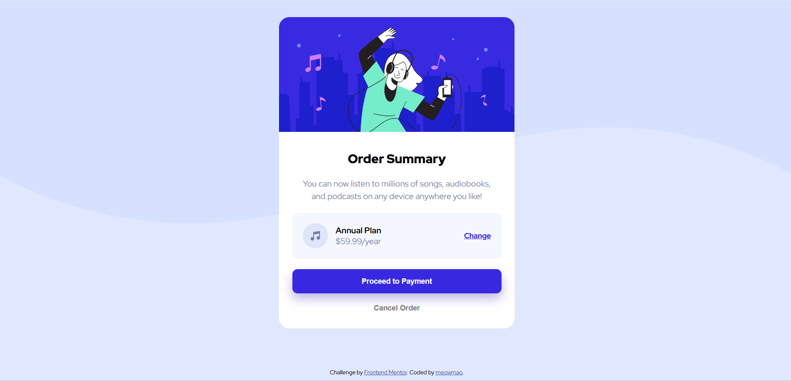

# Frontend Mentor - Order summary card solution

This is a solution to the [Order summary card challenge on Frontend Mentor](https://www.frontendmentor.io/challenges/order-summary-component-QlPmajDUj). Frontend Mentor challenges help you improve your coding skills by building realistic projects. 

## Table of contents

- [Overview](#overview)
  - [The challenge](#the-challenge)
  - [Screenshot](#screenshot)
  - [Links](#links)
- [My process](#my-process)
  - [Built with](#built-with)
  - [Continued development](#continued-development)
- [Author](#author)

## Overview

### The challenge

Your challenge is to build out this order summary card component and get it looking as close to the design as possible.

#### The design:

You can use any tools you like to help you complete the challenge. So if you've got something you'd like to practice, feel free to give it a go.

Your users should be able to:

- See hover states for interactive elements

### Screenshot
#### My solution:

#### Hover states:

#### Mobile view:

### Links

- Solution URL: [My solution](https://github.com/meowmao/FEM-order-summary.git)
- Live Site URL: [Live site preview](https://meowmao.github.io/FEM-order-summary/)

## My process

### Built with

- Semantic HTML5 markup
- CSS custom properties
- Flexbox

### Continued development

- Continue familiarizing myself using flexbox for layout
- Learn responsive design

## Author

- Website - [meowmao](https://github.com/meowmao)
- Frontend Mentor - [@meowmao](https://www.frontendmentor.io/profile/meowmao)
